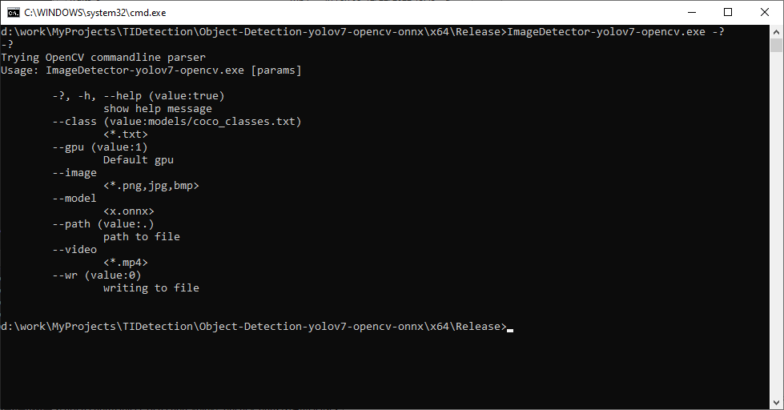
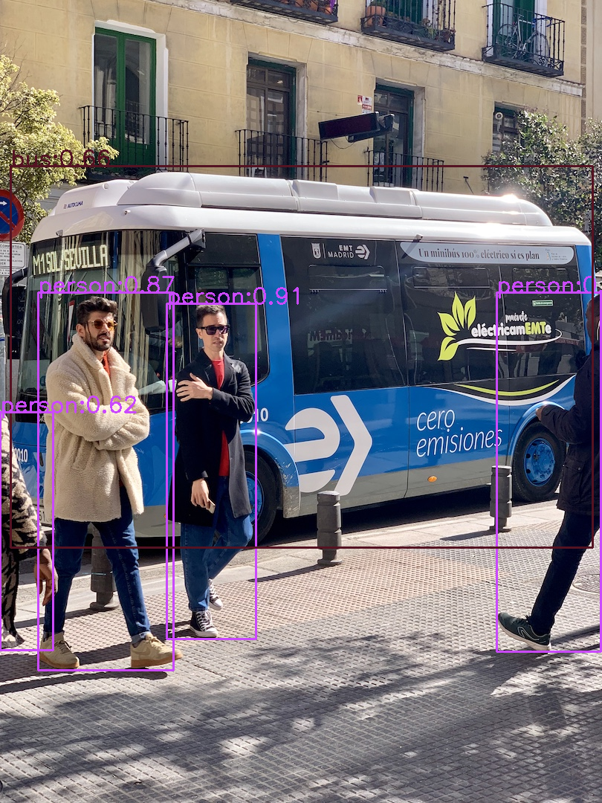

### <div align="center">Object-Detection-yolov7-opencv-onnx</div>
Yolov7 Deep MI ONNX model process with OpenCV DNN C++.<br>
Deep-learning Machine Intelligence Network.<br>
Base is [Yolov7](https://github.com/WongKinYiu/yolov7)<br>
ONNX model format  description using for the IoT device: [ONNX home](https://onnx.ai/)<br>
<br>
[OpenCV office](https://opencv.org/)<br>
[OpenCV 4.6.0 github](https://github.com/opencv/opencv)<br>
[OpenCV 4.6.0 contrib github](https://github.com/opencv/opencv_contrib)<br>
## Enviroment
- Windows 10 64-bit
- NVIDIA Geforce GTX 960 2 Gbyte RAM
- CUDA Toolkit v11.7
- Microsoft Visual Studio Community 2022<br>
## Installation<br>
Downloading opencv files, there files are archive [7-Zip](https://www.7-zip.org/) binary dll files<br> 
-Release mode: one size is 1 Gbye and other 21 Mbyte:<br> 
[`opencv_worl460.dll`](https://drive.google.com/file/d/1G8MZn-uvgRxT0Mdiuidrdi-AmtjqTUwS/view?usp=share_link)<br>
 unzip and copy to "./x64/Release/" directory.<br> 
-Debug mode: one size is 1.4 Gbye and other 21 Mbyte:<br> 
[`opencv_worl460d.dll`](https://drive.google.com/file/d/1Qxn5Ql0G9qRJJ55z_SittQquEIRBNPMP/view?usp=share_link)<br> 
 unzip and copy to "./x64/Debug/" directory.<br>
-include and lib files:<br> 
[`opencv-4.6.0`](https://drive.google.com/file/d/1jUkP5F2EWV5GDPcuR16NSgNjriPjSUtO/view?usp=share_link)<br> 
 unzip and copy to ./3rdparty.<br> 
## Building the ImageDetector-yolov7-opencv VS2022 project
``` shell
-VS2022 started.
-"Open a project or solution".
-in Browse serach the "ImageDetector-yolov7-opencv.sln" file, and it open that.
-Build->Build Solution (F7).
Builded in "./x64/Release/ImageDetector-yolov7-opencv.exe".
```
## Running the "ImageDetector-yolov7-opencv.exe" app.<br>
Program arguments: <br>
<br>
Examples:
``` shell
cd ./x64/Release/ImageDetector-yolov7-opencv_image1.bat
```
Result:<br>
<br>
``` shell
cd ./x64/Release/ImageDetector-yolov7-opencv_video1.bat
```
Result:<br>
<div align="center">
<video src="./x64/Release/fruits_o.mp4" controls></video>
 </a>
</div>
